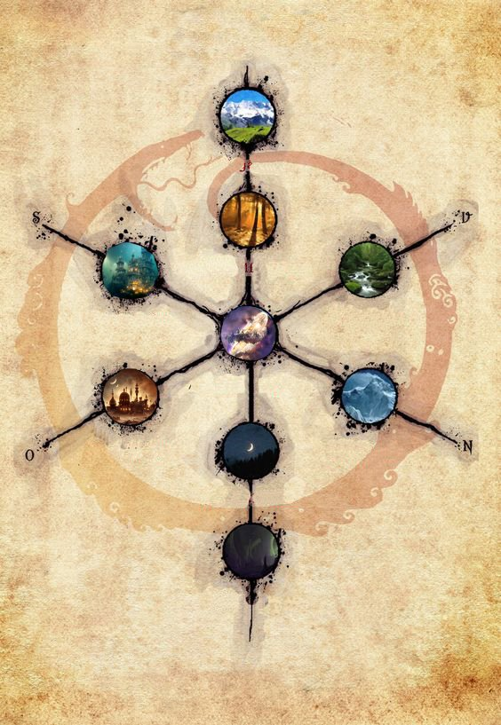

# Sixth Age World Outline

The Sixth Age World Outline is a visual reference for how the major worlds or realms were understood during the Sixth Age.

This image should be treated as a structural outline rather than a fully labeled political map. It shows a central convergence point with multiple connected worlds or realms branching outward, reflecting the pre-[Concurrence](the-concurrence.md) worldview before the [Seventh Age](seventh-age.md) linked and restructured travel, divine access, and world-to-world relationships.

## Use in the Wiki

Use this page as a reference when discussing late Sixth Age geography, the leadup to the [Concurrence](the-concurrence.md), and the way major worlds and realms relate at a world-structure level.

Specific node labels should be added once their positions are confirmed.

## Related

- [Sixth Age](sixth-age.md)
- [The Concurrence](the-concurrence.md)
- [Divine Gate](divine-gate.md)
- [Timeline](timeline.md)
- [War of the Gods / New Beginning Campaign](../campaign/war-of-the-gods.md)
- [Moon Stone Collectors](../campaign/moonstone-collectors.md)
