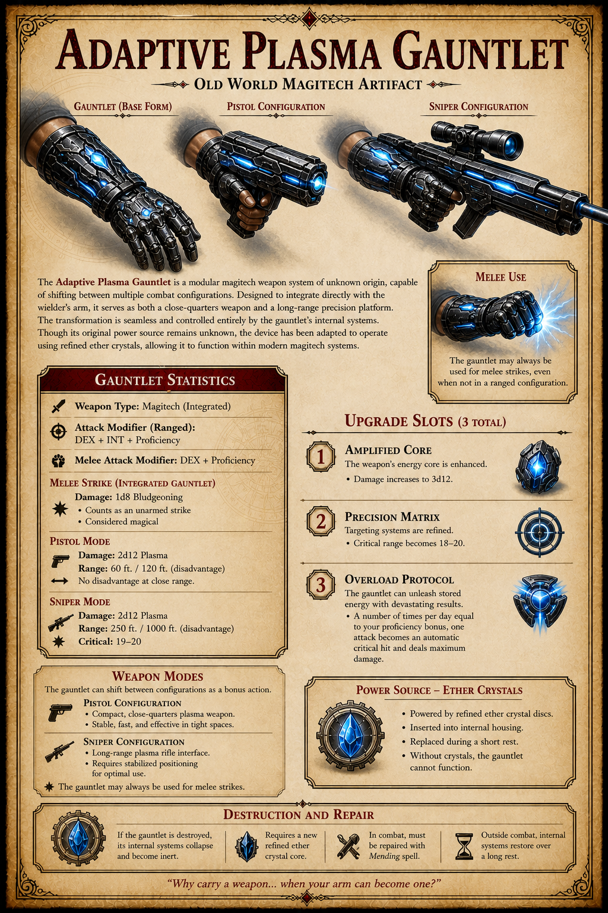

# Adaptive Plasma Gauntlet

The Adaptive Plasma Gauntlet is an Old World magitech artifact: a modular weapon system that integrates with the wielder's arm and shifts between melee, pistol, and sniper configurations.

## Base Statistics

- Weapon type: magitech, integrated.
- Ranged attack modifier: Dexterity + Intelligence + proficiency.
- Melee attack modifier: Dexterity + proficiency.
- Power source: refined ether crystal discs.

## Melee Strike

- Damage: 1d8 bludgeoning.
- Counts as an unarmed strike.
- Considered magical.

## Pistol Mode

- Damage: 2d12 plasma.
- Range: 60 feet / 120 feet at disadvantage.
- No disadvantage at close range.

## Sniper Mode

- Damage: 2d12 plasma.
- Range: 250 feet / 1000 feet at disadvantage.
- Critical range: 19-20.

## Weapon Modes

The gauntlet can shift between configurations as a bonus action.

- Pistol configuration: compact close-quarters plasma weapon, stable and fast in tight spaces.
- Sniper configuration: long-range plasma rifle interface, requiring stabilized positioning for optimal use.
- Melee use: the gauntlet may always be used for melee strikes, even when not in a ranged configuration.

## Upgrade Slots

The gauntlet has three total upgrade slots.

- Amplified Core: damage increases to 3d12.
- Precision Matrix: critical range becomes 18-20.
- Overload Protocol: a number of times per day equal to proficiency bonus, one attack becomes an automatic critical hit and deals maximum damage.

## Destruction and Repair

If the gauntlet is destroyed, its internal systems collapse and become inert. It requires a new refined ether crystal core. In combat, it must be repaired with `Mending`; outside combat, its internal systems restore over a long rest.

## Related

- [Ether Crystals](ether-crystals.md)
- [Kex](../places/kex.md)
- [Ship Augmentation Modules](ship-augmentation-modules.md)
