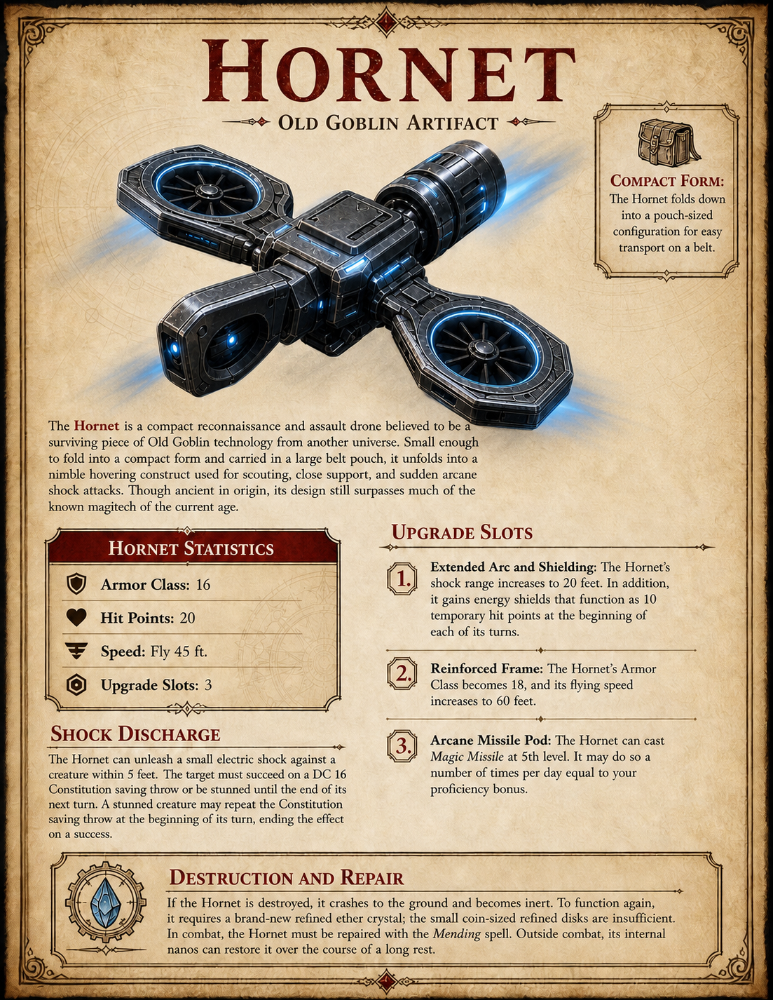

# Hornet

Hornet is a compact reconnaissance and assault drone believed to be a surviving piece of Old Goblin technology from another universe. It folds into a pouch-sized compact form and unfolds into a nimble hovering construct for scouting, close support, and sudden arcane shock attacks.

## Statistics

- Armor Class: 16.
- Hit Points: 20.
- Speed: fly 45 feet.
- Upgrade slots: 3.

## Compact Form

Hornet folds into a pouch-sized configuration small enough to carry on a belt.

## Shock Discharge

Hornet can unleash a small electric shock against a creature within 5 feet. The target must succeed on a DC 16 Constitution saving throw or be stunned until the end of its next turn.

A stunned creature may repeat the Constitution saving throw at the beginning of its turn, ending the effect on a success.

## Upgrade Slots

- Extended Arc and Shielding: shock range increases to 20 feet, and Hornet gains an energy shield functioning as 10 temporary hit points at the beginning of each of its turns.
- Reinforced Frame: Armor Class becomes 18 and flying speed increases to 60 feet.
- Arcane Missile Pod: Hornet can cast `Magic Missile` at 5th level a number of times per day equal to proficiency bonus.

## Destruction and Repair

If destroyed, Hornet crashes and becomes inert. To function again, it requires a brand-new refined ether crystal; small coin-sized refined discs are insufficient. In combat, Hornet must be repaired with `Mending`; outside combat, its internal nanos can restore it over a long rest.

## Campaign Notes

Session 8 confirms [Captain Sgt. Jose](../people/jose.md) uses a Kex-derived Hornet drone during the temple trials.

## Related

- [Captain Sgt. Jose](../people/jose.md)
- [Kex](../places/kex.md)
- [Session 8](../sessions/session-8.md)
