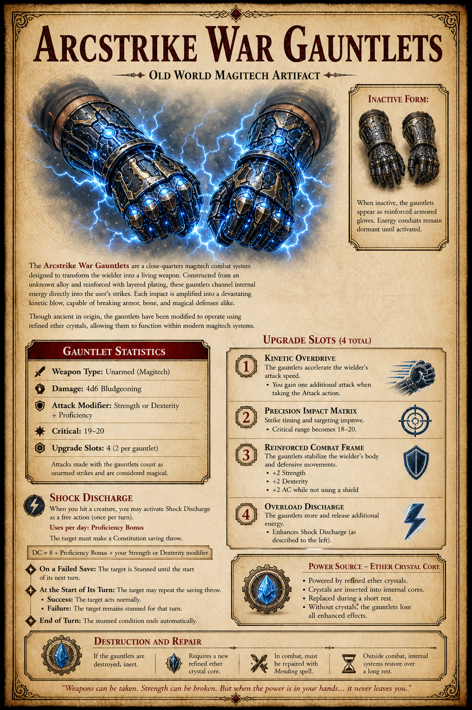

# Arcstrike War Gauntlets

The Arcstrike War Gauntlets, previously tracked as the Ship-Forged Gauntlets, are the Kex-built close-combat weapons made for [Captain Sgt. Jose](../people/jose.md) in [Session 6](../sessions/session-6.md).

## Origin

In Session 5, after [Jose](../people/jose.md) becomes captain of the [Kex](../places/kex.md), he leaves Kreen skull/axe material and related parts with [Kubix](../people/kubix.md).

The goal is to turn the recovered and personal materials into a matched pair of mechanical gauntlets. The current item card frames the finished form as an Old World magitech artifact adapted to operate with refined ether crystal cores.

## Completion

At the start of Session 6, Kubix informs Jose that the gauntlets are ready in the fabrication bay just off engineering.

The transcript confirms that the gauntlets are no longer only a future plan. They are completed and issued before the party leaves the Kex to resume the [Lost Homeland Mission](../concepts/lost-homeland-mission.md).

## Attunement

When Jose puts the gauntlets on, they briefly cut his skin. His blood and nanites connect to the gauntlets, establishing attunement.

That makes the gauntlets a hybrid of:

- recovered Kreen-linked weapon material
- Kex fabrication
- ship augmentation technology
- Jose's post-nanite body

## Current Item Card

The current visual item card gives the following usable mechanics:

- Weapon type: unarmed magitech gauntlets.
- Damage: 4d6 bludgeoning.
- Attack modifier: Strength or Dexterity plus proficiency.
- Critical range: 19-20.
- Upgrade slots: 4 total, 2 per gauntlet.
- Attacks made with the gauntlets count as unarmed strikes and are considered magical.

### Shock Discharge

When Jose hits a creature, he may activate Shock Discharge as a free action once per turn.

- Uses per day: proficiency bonus.
- Save DC: 8 + proficiency bonus + Jose's Strength or Dexterity modifier.
- On a failed Constitution save, the target is stunned until the start of its next turn.
- At the start of its turn, the target may repeat the save. On a success, it acts normally. On a failure, it remains stunned for that turn.
- At the end of the turn, the stunned condition ends automatically.

### Upgrade Slots

- Kinetic Overdrive: grants one additional attack when taking the Attack action.
- Precision Impact Matrix: critical range becomes 18-20.
- Reinforced Combat Frame: grants +2 Strength, +2 Dexterity, and +2 AC while not using a shield.
- Overload Discharge: enhances Shock Discharge.

## Card / Transcript Note

The Session 6 transcript establishes the fabrication and attunement event aboard the [Kex](../places/kex.md). The item card supplies the current mechanics and visual identity. Treat `Ship-Forged Gauntlets` as the older working name.

## Related

- [Captain Sgt. Jose](../people/jose.md)
- [Kex](../places/kex.md)
- [Kubix](../people/kubix.md)
- [Ship Augmentation Modules](ship-augmentation-modules.md)
- [Session 5](../sessions/session-5.md)
- [Session 6](../sessions/session-6.md)
