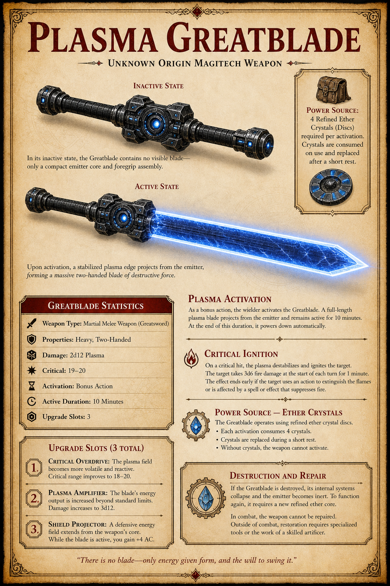

# Plasma Greatblade

The Plasma Greatblade is an advanced magitech weapon recovered from [the crashed ship](../places/crashed-ship.md). It is a self-contained plasma weapon system powered by refined energy discs.

## Item Card

### Weapon Type

Two-handed melee weapon, heavy.

### Base Damage

2d12 plasma damage.

### Properties

- Heavy
- Two-handed
- Magical
- Energy weapon

## Core Function

As a bonus action, you ignite the blade.

- The weapon remains active for 10 minutes.
- At the end of the duration, it powers down.
- Activation requires 4 refined energy discs.
- Discs must be replaced after use.

## Critical Strike

The weapon scores a critical hit on a 19-20.

## Ignition Effect

When you score a critical hit, the target ignites in unstable plasma fire.

- The target takes 3d6 fire damage at the start of each of its turns.
- The effect lasts for 1 minute.
- The effect ends early if the target uses an action to extinguish it.
- The effect also ends early if magic or external force puts it out.

## Upgrade Slots

The weapon contains three permanent upgrade slots. Installed upgrades cannot be removed.

### Slot 1: Critical Overdrive

The critical range improves to 18-20.

### Slot 2: Plasma Amplifier

The weapon's damage increases to 3d12.

### Slot 3: Shield Projector

While the blade is active, the wielder gains +4 AC.

## Magitech Notes

This is not an [Ether Conductor](ether-crystals.md). It is a self-contained plasma weapon system powered entirely by refined energy discs.

## Flavor Text

> "Two cores. One purpose. When it ignites, it doesn't just cut; it consumes."

## DM Notes

The weapon is strong, but gated by limited activation time and refined energy-disc expenditure. The critical ignition effect should feel like a signature weapon moment, while the upgrade path gives the blade a clear long-term progression.

## Transcript Note

Session 4 and Session 5 discuss slightly different damage and slot values for this weapon. Session 6 confirms that [Sgt. Jefferson Stone](../people/sergeant-jefferson-stone.md) installs the first upgrade, improving the critical range to 18-20. The rest of the item card should still be checked against the live character sheet before play.

## Related

- [The Crashed Ship](../places/crashed-ship.md)
- [Ether Crystals](ether-crystals.md)
- [Nanite Pods](nanite-pods.md)
- [Session 4](../sessions/session-4.md)
- [Session 5](../sessions/session-5.md)
- [Session 6](../sessions/session-6.md)
