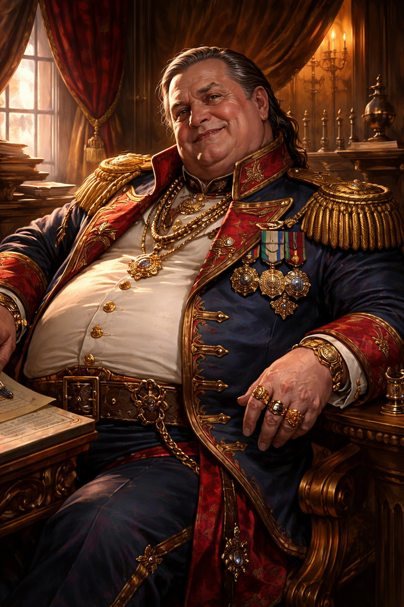

# Colonel Marrow Vance

Colonel Marrow Vance is the corrupt commander of [Fort Victory](../places/fort-victory.md) before the [Inquisition](../factions/inquisition.md) purge.

## Personality and Role

Vance is indulgent, richly dressed, decorated, and openly transactional. He frames [Fort Victory](../places/fort-victory.md)'s fog-resource monopoly as legal military policy and tells the party not to rock the boat.

## Corruption

Vance benefits from:

- artifact fines
- finder-fee manipulation
- private arrangements with [Sin](../places/sin.md)
- leverage and blackmail through [The Silk Parlor](../places/silk-parlor.md)

## Death

In [Session 4](../sessions/session-4.md), Vance is publicly executed by [Lord Inquisitor Boss](lord-inquisitor-boss.md) during reveille.

The same transcript clarifies why the party is not treated as part of his corruption ring: Vance's system was corrupt, but much of the party's pay and finder-fee paperwork was still documented well enough for [Colonel Core](colonel-core.md) to accept it as legal.

## Related

- [Fort Victory Corruption Ring](../concepts/fort-victory-corruption-ring.md)
- [Mistress Selyra Vex'ryn](mistress-sila-vexry.md)
- [Colonel Core](colonel-core.md)
