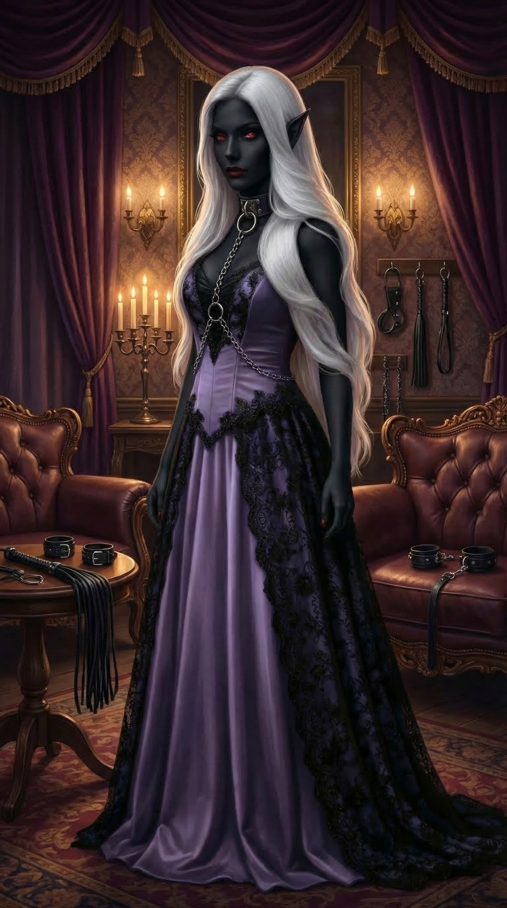

# Mistress Selyra Vex'ryn

Mistress Selyra Vex'ryn is the drow matron of [The Silk Parlor](../places/silk-parlor.md) in [Sin](../places/sin.md).

## Role

Selyra is likely the strongest local power broker in [Sin](../places/sin.md). She runs a luxury house, casino, intelligence operation, and artifact network.

## Offer to the Party

Selyra offers double the standard fine for each of her scavenging parties the party does not report. She also wants drow-nature artifacts from the fog.

## Leverage

She shows the party compromising magical evidence involving [Colonel Marrow Vance](colonel-marrow-vance.md), making clear that she has leverage over [Fort Victory](../places/fort-victory.md) command.

## Status

After the [Inquisition](../factions/inquisition.md) arrives, the party avoids direct contact with her. [Granny](granny.md) warns that Selyra's people may try to kill them once they no longer have military protection.

## Temple Resemblance

In [Session 8](../sessions/session-8.md), the ghost priestess at [Ssar'Velyn Temple](../places/ssar-velyn-temple.md) resembles Selyra strongly enough that the transcript compares them as possible sisters or mother and daughter.

That is only a resemblance for now. The wiki should not treat Selyra as confirmed kin to the ghost priestess unless later canon states it directly.

## Session 9 Temple Involvement

In [Session 9](../sessions/session-9.md), Selyra appears to [Sgt. Jefferson Stone](sergeant-jefferson-stone.md) inside an office in [Ssar'Velyn Temple](../places/ssar-velyn-temple.md).

She calls the room her mother's office and claims that the temple was dedicated to [Lolth](lolth.md)'s path to ascension. She tells Jefferson that the old crusader assault damaged the temple's vats, defenses, and processes, and she claims the immediate corruption source is something imprisoned in a cave south along the wall.

Her statements should be handled cautiously. Jefferson's insight suggests she is mixing truth, omissions, and likely lies. Her promise that the valley's blood oath can be `released` is especially dangerous because [Rurik Valdren](rurik-valdren.md) later warns that release language in blood magic can mean more than safe liberation.

## Her Brother and the Penitent

Selyra has a **brother** active in the Sunhollow operation. He cannot enter [Ssar'Velyn Temple](../places/ssar-velyn-temple.md) — the temple bars males — but he spent years hunting its location alongside her.

Per GM ruling (2026-07-31): the church's dead scout in the valley was a **penitent** — one of the faithful damned, sent to chase the imprisoned demon's emanations with old artifacts. **Selyra's brother trailed the penitent down and killed him.** Session 10 counts fifteen black arrows in the scout's back; the valley patrol truthfully denied firing them. Jefferson followed the dead man's beacon without knowing any of this.

In [Session 10](../sessions/session-10.md), Bartholomew identifies the arrows as the work of one maker from his own era and recognizes Selyra's brother watching from the cliffs after the party moves the body, removes the arrows, repositions the beacon, and erases its tracks. The brother's personal name remains undisclosed in player-facing canon.

She also mentions in Session 9 that the party failed to "return my notes" ⚠ — an unexplained grievance, possibly referring to the book [Bevar Lurton](bevar-lurton.md) took from the ruins, or to her murdered team's effects from Session 3.

## Related

- [The Silk Parlor](../places/silk-parlor.md)
- [Silk Parlor Network](../factions/silk-parlor-network.md)
- [Rurik Valdren](rurik-valdren.md)
- [Ssar'Velyn Ghost Priestess](ssar-velyn-ghost-priestess.md)
- [Ssar'Velyn Temple](../places/ssar-velyn-temple.md)
- [Session 9](../sessions/session-9.md)
- [Session 10](../sessions/session-10.md)
