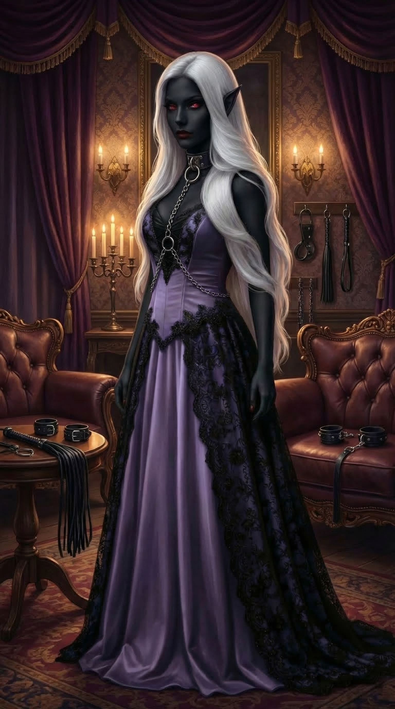

# Mistress Selyra Vex'ryn

Mistress Selyra Vex'ryn, transcribed in earlier session notes as Mistress Sila Vex'Ry, is the drow matron of [The Silk Parlor](../places/silk-parlor.md) in [Sin](../places/sin.md).

## Name Notes

The newer Sin setting brief and supplied visual reference use Selyra Vex'ryn. Session 3 and Session 4 transcript summaries used Sila Vex'Ry or similar transcript spellings. These are treated as the same person unless future canon separates them.

## Role

Selyra is likely the strongest local power broker in [Sin](../places/sin.md). She runs a luxury house, casino, intelligence operation, and artifact network.

## Offer to the Party

Selyra offers double the standard fine for each of her scavenging parties the party does not report. She also wants drow-nature artifacts from the fog.

## Leverage

She shows the party compromising magical evidence involving [Colonel Marrow Vance](colonel-marrow-vance.md), making clear that she has leverage over [Fort Victory](../places/fort-victory.md) command.

## Status

After the [Inquisition](../factions/inquisition.md) arrives, the party avoids direct contact with her. [Granny](granny.md) warns that Selyra's people may try to kill them once they no longer have military protection.

## Temple Resemblance

In [Session 8](../sessions/session-8.md), the ghost priestess at [Ssar'Velyn Temple](../places/ssar-velyn-temple.md) resembles Selyra strongly enough that the transcript compares them as possible sisters or mother and daughter.

That is only a resemblance for now. The wiki should not treat Selyra as confirmed kin to the ghost priestess unless later canon states it directly.

## Session 9 Temple Involvement

In [Session 9](../sessions/session-9.md), a figure identified in the transcript as Mistress Vexaran or Vexeran appears to [Sgt. Jefferson Stone](sergeant-jefferson-stone.md) inside an office in [Ssar'Velyn Temple](../places/ssar-velyn-temple.md). This wiki treats that as Mistress Selyra Vex'ryn unless later canon separates the temple figure from the Silk Parlor mistress.

She calls the room her mother's office and claims that the temple was dedicated to [Lolth](lolth.md)'s path to ascension. She tells Jefferson that the old crusader assault damaged the temple's vats, defenses, and processes, and she claims the immediate corruption source is something imprisoned in a cave south along the wall.

Her statements should be handled cautiously. Jefferson's insight suggests she is mixing truth, omissions, and likely lies. Her promise that the valley's blood oath can be `released` is especially dangerous because [Rurik Valdren](rurik-valdren.md) later warns that release language in blood magic can mean more than safe liberation.

## Related

- [The Silk Parlor](../places/silk-parlor.md)
- [Silk Parlor Network](../factions/silk-parlor-network.md)
- [Rurik Valdren](rurik-valdren.md)
- [Ssar'Velyn Ghost Priestess](ssar-velyn-ghost-priestess.md)
- [Ssar'Velyn Temple](../places/ssar-velyn-temple.md)
- [Session 9](../sessions/session-9.md)
