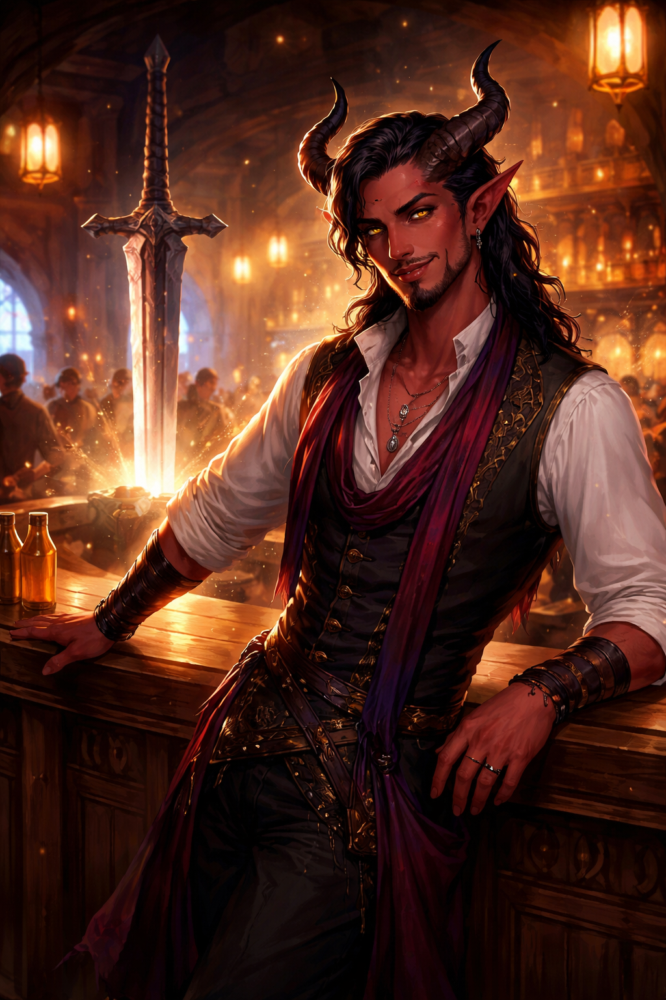

# Vaelis Brighttongue

Vaelis Brighttongue is a flamboyant male tiefling bard and proprietor at [The Singing Sword](../places/singing-sword.md).

## Role

Vaelis welcomes the party to [Sin](../places/sin.md)'s soldier tavern and gives local advice about:

- [Calvin's Curios](../places/calvins-curios.md)
- [The Silk Parlor](../places/silk-parlor.md)
- gambling and safer card games
- the town's social hierarchy

## Personality

Charismatic, theatrical, warm, and far sharper than he first appears. Vaelis runs the tavern like a stage, remembers faces and names with unnerving ease, and knows how to make people talk.

## Related

- [Granny](granny.md)
- [The Singing Sword](../places/singing-sword.md)
- [Session 3](../sessions/session-3.md)
